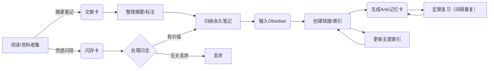
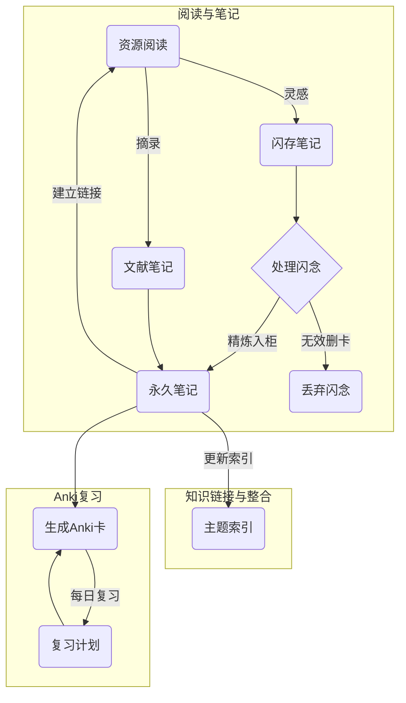

# 执行摘要  
本文针对考研场景下的记忆与笔记需求，提出了一套可操作的知识管理方案。我们**区分并定义三类笔记**：**闪存卡**（灵感/想法笔记）、**文献卡**（阅读记录笔记）和**记忆卡**（汇总笔记，用于Anki背诵）。针对**Obsidian中的文献库建设**，建议采用统一的文件结构和YAML元数据模板（字段包括作者、年份、页码、引用内容、主题标签、唯一ID等），并利用Obsidian的双向链接和插件（如Zotero Integration、Dataview）实现笔记间的自动/手动关联。为**Anki卡片设计模板**，提供了基础卡和填空卡（Cloze）的示例，示例内容结合笔记中的概念和引用，着重体现概念之间的联系。**构建概念联系**的方法包括使用Obsidian的双向链接、网络图视图、主题索引卡、序列/结构化笔记以及聚合卡片等形式，并介绍了如何将这些关联转化为Anki复习内容（如关联型问题）。**复习策略**方面，我们按照考研周期建议了不同笔记的复习频率和优先级，如闪存卡以即刻处理为主，文献卡在阅读后定期回顾，记忆卡遵循间隔重复原则（如1天、3天、7天等）；并讨论了选择性回顾（按标签、紧急度筛选）与全面回顾的权衡。针对**卢曼笔记法**，分析了其在无软件环境下的认知策略：通过**外部化笔记、唯一编号、索引索引系统、频繁回顾**等手段，将记忆转移到卡片盒上【41†L130-L134】【36†L18-L24】。最后给出详细的**操作流程图**（使用Mermaid绘制）和**任务清单**（每日/每周/每月任务），并用表格比较不同方案的优缺点及适用场景。全文引用了权威来源，如卢曼笔记法原著、中英文Anki/Obsidian文档，以及学习记忆相关研究成果。

## 笔记类型定义  
- **闪存卡（灵感笔记）**：用于捕捉瞬间灵感和短期想法的笔记，形式随意（比如手机或纸上记录），寿命很短，通常**在一两天内被处理或丢弃**【6†L151-L154】。它与“闪念笔记”（fleeting notes）相当，用来防止遗漏临时想法【6†L151-L154】。  
- **文献卡（阅读笔记）**：针对所读文献或资料的笔记，记下关键内容、摘录和个人理解。文献卡**注重引用来源**（记录作者、书名、页码等）并用自己的话总结核心要点【6†L128-L133】。这些笔记简短、精炼，只记录可能有用的信息，保存于文献管理系统或Obsidian中以便后续引用。  
- **记忆卡（复习卡）**：对闪存卡和文献卡内容的**凝练与整合**，用于实际记忆和复习的Anki卡片。记忆卡将一个或多个概念做成问答（正面提问，背面回答）或填空（Cloze）形式的卡片，通过间隔重复算法加强长期记忆【11†L81-L83】。与前两者不同，记忆卡是“存储在Anki中的笔记”，重点在于考试或长期记忆的效果。

以上分类对应罗伯特·阿伦斯等人总结的笔记流程【6†L128-L133】【6†L150-L154】：**闪念笔记**（fleeting）迅速记录想法；**文献笔记**（literature）记录阅读内容；**永久笔记**（permanent）则与记忆卡类似，整理为可长期保存和串联的知识单元。Luhmann等学者认为，笔记系统应避免孤立笔记堆积，而要**强调笔记间的连接**【34†L90-L94】【36†L48-L54】。  

## Obsidian文献库构建  
在Obsidian中建立文献库时，推荐使用单独的文件夹（如“Literature”或“Reading Notes”）保存各篇文献的笔记。**文件结构**可以按照主题或学科分层，如：`Literature/主题/` 或 `Literature/年份/`。每篇文献对应一个Markdown文件，建议文件名包含唯一ID（如引用键citekey或时间戳）以避免冲突【36†L25-L33】【36†L91-L94】。

在每个文献笔记文件的开头使用YAML Frontmatter记录**元数据模板**，例如：  
```yaml
---
title: 论文/书籍标题
authors: [作者1, 作者2]
year: 2020
source: 期刊名或出版社
pages: "123-130"
url: 引用链接或DOI
tags: [主题1, 主题2]
id: 20230509-001        # 自定义唯一ID
aliases: [主题别名1, 别名2]
---
```
这样的模板字段来自社区经验【21†L145-L153】和Zotero导出示例【26†L170-L179】【26†L185-L189】。其中`authors/year`等提供引用信息，`tags`标记主题，`id`作为笔记的唯一标识符（可用时间戳或卢曼式编码【36†L25-L33】）。**备注**：字段名可以中英混用，但建议保持一致方便Dataview等插件调用。

**自动/手动链接**：可在笔记正文或YAML中使用Obsidian的Wiki链接`[[笔记文件名或ID]]`来关联相关笔记。例如，在文献笔记中引用永久笔记或其他文献时，将对方ID放入`[[ ]]`即可生成双向链接，并通过侧边栏“Backlinks”查看关联。在YAML中，也可以添加自定义字段如 `related: [[ID1]], [[ID2]]` 指出关联笔记。借助Dataview等插件，还可根据标签或元数据字段自动生成文献列表和关联网络【26†L234-L242】【36†L48-L54】。此外，Obsidian社区插件（如Zotero Integration）可自动从Zotero导入文献条目和批注，并按模板填写元数据【26†L170-L179】【26†L185-L189】，大大简化笔记创建过程。

## Anki卡片模板与示例  
设计Anki卡片时，既要覆盖知识点，又要体现概念联系，避免孤立死记。推荐使用**基础卡（Basic）**和**填空卡（Cloze）**两种模板：  
- **基础卡示例**（正面=问句，背面=答案）：  
  - *模板*: 前面写清晰问题或提示，背面写详细答案并说明关联。  
  - *示例*:  
    - 正面：**“什么是闪念笔记？它与永久笔记有何区别？”**  
    - 背面：  
      > “闪念笔记用于随时记录灵光一现的想法，形式不限，通常在1-2天内处理后删除【6†L151-L154】。永久笔记（或记忆卡）则用自己的语言精炼信息，附加引用来源，长期存放于卡片盒中【6†L150-L154】。”  
    - 备注：背面引用了笔记来源，并强调两个概念的联系（由对比体现）。  
  - *间隔标签*：可添加标签如 `#闪念笔记`、`#记忆笔记`，便于后续筛选。  

- **填空卡（Cloze）示例**：将完整的笔记句子加以部分遮蔽，帮助记忆具体信息或链接。  
  - *示例1*: “闪念笔记将在{{c1::一两天}}内被扔掉【6†L151-L154】。”  
  - *示例2*: “卢曼的卡片笔记系统强调每条笔记之间的**连结**，通过这种超文本结构形成一个**思想之网**【34†L90-L94】【36†L48-L54】。”（在此卡片中可以遮蔽“连结”和“思想之网”关键词）  
  - 这样的填空卡将概念置于上下文中，有助于关联记忆，而非孤立记忆单词或事实。  

**卡片设计要点**：每张卡片尽量只聚焦一个或少量关联概念，答案要写得简洁完整，可以在背面加粗或添加超链接以便复查原笔记。除了基本问答/填空，可以设计“关联型问题”卡片，例如“概念A与概念B的关系是什么？”，促使记忆时也回顾笔记间的联系。为提高复习效率，卡片可添加难度标签、主题标签等（如Anki的标签机制），并根据掌握程度用Anki的“轻松/良好/困难”按钮调整复习间隔。

## 联系构建与转化  
知识联系的显式记录是卢曼法的核心，也是增强记忆的关键。在Obsidian笔记中，可以通过以下方式构建和可视化概念关系：  
- **双向链接**：利用`[[笔记名或ID]]`在笔记间创建超链接。比如在相关笔记中互相引用，通过链接形成网络。Obsidian的**Graph视图**可直观展示整个笔记网络，帮助发现未链接的新关系。  
- **主题索引（结构化笔记）**：当某一主题相关笔记积累足够多时，新建一个主题索引笔记，汇总所有子笔记的ID并作简要说明【4†L62-L70】【36†L74-L81】。这类似卢曼的主题索引卡，是进入某主题的“入口”【4†L62-L70】。结构化笔记（Structure Note）记录笔记间逻辑关联，并可在背面写出一个论证或知识框架【36†L49-L54】【36†L83-L90】。  
- **序列/链式笔记**：对有时间或逻辑顺序的内容（如步骤、历史脉络），可创建连续编号笔记，或在每张笔记的元数据（如YAML中的`prev:: [[ID]] next:: [[ID]]`）注明前后关联，形成线性链条。这有助于回顾时顺序阅读。  
- **聚合卡片**：制作聚合笔记，将多个零散笔记的共同信息汇总。例如，将同一主题下相关文献的要点集中到一张笔记中，并链接回各文献笔记。这种卡片汇总了知识点，也便于在Anki中做总结型题目。  

将这些联系转化为Anki复习：可以在Anki卡片中加入关联提示，比如卡片问题提及关联笔记或使用跨卡片的对比来提问，促使记忆时触发链接记忆。例如，在卡片中补充“见笔记[[20230509-001]]与[[20230511-002]]的链接”，或在答案中列举相互关联的概念组。这种方法让Anki的复习不再孤立，而是让两个或多个知识点“对话”，更符合卢曼将知识视为网状结构的理念【34†L90-L94】【36†L48-L54】。



## 复习策略与计划  
**闪存卡**：应**及时复习/处理**，最好当天或次日将闪现的想法整合到永久笔记中或生成相应的Anki卡。不需要预定周期长时间复习，因为大部分闪念笔记是为激发灵感服务，不是主要知识点。  

**文献卡**：在完成阅读后立即复盘摘要，置入Obsidian文献库。**定期回顾**建议：可在学期末或写作前做一次整体浏览，也可通过主题索引笔记进行有针对性的复习。例如，每隔1-2周检查一次最近更新的文献笔记，将新的理解融入永久笔记系统，或在写作时重点回顾相关领域笔记。对于考研来说，可将核心教材和重要文献的笔记纳入计划，比如每月回顾一次笔记摘要，防止知识遗忘。  

**记忆卡（Anki）**：严格遵循间隔重复原则。一般流程为：新卡创建后**当天**复习（最好当天晚些时候）；之后**1天、3天、7天、14天、30天**等逐步拉长复习间隔（也可让Anki根据“难易”自动调整）【11†L81-L83】。根据考研时间表，可在考试前集中针对薄弱点调整：如临考前将标记为“重要”的卡片标记为“失败”（让间隔最短）以加密复习。Anki的牌组分级功能可按科目或标签筛选复习，比如每晚先复习“所有需要考试的科目”卡片，再补充其他知识。  

**全量 vs 选择性复习**：不必所有笔记都等比例复习。对于即将考试的重点学科，可对相关笔记和记忆卡提高优先级；对于与考研关系不大的知识，可标记为低优先级或暂缓复习。Obsidian的标签和元数据筛选可辅助此决策（如标签“必考” vs “选学”）。同时，每日/每周定期**“抽查式复习”**几张旧卡，帮助加深旧知识印象【39†L65-L73】。  

结合考研周期，一般建议：  
- **每日**：Anki卡片复习（数十张新旧卡）；处理当天所有闪存笔记和文献笔记。  
- **每周**：整理本周收集的资料，将新笔记导入Obsidian并生成相应永久笔记；检查主题索引笔记是否更新；安排一次跨科目回顾（可利用数据查看插件列出最近更新笔记）。  
- **每月**：回顾主要科目的知识图谱或索引笔记，生成月度总结（哪些卡片通过了，哪些需要加练）；清理无用闪存笔记；检查复习计划与考试倒计时的匹配度（如提前重点复习难点科目等）。  

## 卢曼笔记法的认知策略  
卢曼在无软件环境下的笔记系统也为我们提供了可借鉴的策略：  
- **外部化思维**：卢曼强调“**不写作，就无法思考**”，只有将思考通过笔记固定在外部，才能被回顾和讨论【41†L130-L134】。这种做法释放了大脑负担，将知识外化为物理卡片（或数字笔记），形成“外部记忆”。  
- **唯一标识符与索引**：每张卡片都有一个**唯一ID**（卢曼多用数字字母组合，如“编号+子编号”形式）来定位和引用【36†L25-L33】。这类似于Obsidian笔记的文件名或YAML中的ID字段。唯一ID让笔记可互连、可查找；卢曼还使用主题索引卡记录各主题入口【36†L73-L81】。  
- **频繁回顾（高频复述）**：卢曼将卡片盒视为“对话伙伴”，**经常翻阅旧卡片**，让新旧知识不断对话【39†L65-L73】。他把知识看作动态网络，只有在不断复习和关联中才会生长（这类似将复习融入每次写笔记、写作流程【39†L92-L100】）。实践中，卢曼每天都会检查新旧笔记，确保每条新笔记至少与已有笔记建立链接【36†L48-L54】【39†L90-L100】。  
- **递进编号和结构化**：卢曼用层级编号系统组织卡片，这些编号并非内容结构，而是帮助检索和添加关联【36†L25-L33】【36†L49-L54】。他还会创建枢纽笔记，将同主题的笔记ID汇总，类似结构化笔记（Structure Note）【36†L73-L81】。  

**与现代工具的异同**：卢曼的核心思路在于“链接和复述大于简单记忆”，这与Obsidian笔记和Anki复习的理念不谋而合【34†L90-L94】【11†L81-L83】。区别在于：卢曼以纸质卡片和手写索引为载体，搜索和重组速度受限；现代数字工具则利用超链接、全局搜索和自动化插件提升效率。比如，Obsidian中可以快捷双链和Tag检索，Anki自动计算复习间隔；而卢曼依靠手工编号和主题索引来找到相关卡片【36†L25-L33】【41†L130-L134】。两者互补：可将卢曼的外部化思想、链接强度保持下来，同时借助软件提高可用性。总之，本质策略——**把知识分解为原子单元并构建网络，经常检索旧知识**——在无论纸质还是数字环境下都是有效的记忆增强方法【41†L130-L134】【39†L65-L73】。

## 实操工作流（任务清单）  
- **每日任务**：捕捉灵感（闪存卡）；处理和归档新的阅读摘录（文献卡）；在Obsidian中将当天阅读/听讲要点整理为文献笔记；生成或更新永久笔记，并相互链接；进行Anki卡片的当日回顾。  
- **每周任务**：复盘上周笔记：浏览所有新增笔记，更新主题索引；将文献笔记中有价值内容汇总为永久笔记并链接到相关主题；设计并批量添加新的Anki卡片；检查复习计划，对落后卡片调整优先级。  
- **每月任务**：生成月度总结笔记，将月内主题索引串联，填写遗漏条目；利用Dataview插件或者Obsidian的每日/周期回顾插件，检查长期未更新但重要的知识点；调整Anki牌组设置（如新卡/复习卡比例）以配合考试倒计时；进行全科目概览复习，巩固长期记忆。  

下面是一张示例流程图，概括了阅读–笔记–复习的循环流程（使用Mermaid语法可视化）：  



## 不同方案对比表

| 方案类型             | 优点                                                         | 缺点                                                          | 适用场景                                                       |
|--------------------|------------------------------------------------------------|-------------------------------------------------------------|-------------------------------------------------------------|
| **纯Anki记忆法**       | 利用间隔重复强化记忆，记忆效率高；操作简单，只关注记忆卡片【11†L81-L83】。       | 知识孤立易碎，卡片制作量大；难以形成知识网络，缺少灵活演绎。                | 背诵性强的内容（词汇、公式、定义）复习；短期考试集训。                   |
| **纸质卡片盒（卢曼式）** | 强调概念连结和长期思考；构建个人知识网络，促进创新；无需软件，随时“对话”旧卡【39†L65-L73】【36†L48-L54】。 | 管理成本高（手工编号、查找慢）；不支持自动复习计划；数字整合差。                | 学术研究、论文写作、知识积累为目的；适合喜欢手写和深度思考的情况。        |
| **Obsidian数字笔记**   | 结合卢曼思路和数字化优势：超链接快速检索，标签与Dataview等插件辅助管理；支持图谱可视化和全文搜索。   | 学习曲线高，需要设置模板和插件；只建立知识结构，不自带复习机制；存储需备份。      | 通用知识管理；跨学科长期研究；需要随时访问和修改笔记；喜欢数字工具的用户。   |
| **Obsidian+Anki混合** | 汇聚两者优势：Obsidian构建知识网络（“提取强度”），Anki保证记忆巩固（“存储强度”）【11†L81-L83】；知识可检索且易复习。 | 需同时维护笔记系统和牌组，工作量大；需要合理规划何时生成Anki卡；可能混淆管理。    | 考研等需要记忆与理解兼顾的场景；希望长期积累知识同时备考；强调知识灵活运用。 |
| **传统读书笔记**       | 方法简单直观（如线性笔记、思维导图）；入门门槛低。                       | 多为孤立笔记，缺少跨笔记联系；长期效果不明显，容易遗忘。                      | 临时复习、应付课堂考试；对知识系统性要求不高的学习。                   |

上述方案中，**Obsidian+Anki混合**方案最全面，但要求较高的执行力；**纸质卡片盒**在强调创新思考上独树一帜，但缺少自动化工具的便利；**纯Anki**则适合需要快速记忆大量知识的考试场景。读者可根据自身需求和考研科目（理工或文科）调整权重：例如，背诵任务重的科目（如医学名词）可偏重Anki方案，而注重理解和写作的科目（如文综、历史）可强化Obsidian笔记法的知识结构。  

**参考文献**：卢曼笔记法原著及教程【34†L90-L94】【36†L48-L54】；Anki/Obsidian官方文档与社区教程【26†L170-L179】【26†L185-L189】【21†L145-L153】；学习记忆科学【11†L81-L83】【41†L130-L134】等。文章引用了上述来源的重要观点供读者查阅。