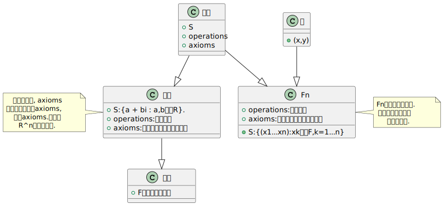
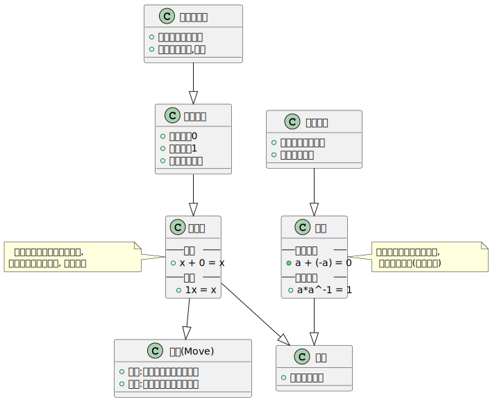
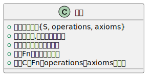

&emsp;&emsp;@author 巷北  
&emsp;&emsp;@time 2026-04-18 12:25:57  

  
<strong>🟩 宏观动机</strong>

    

  
<strong>🟩 本小节理解图</strong>

    

  
<strong>🟩 单位元与逆元的意义</strong>

    

  
<strong>🟩 总结</strong>

    

