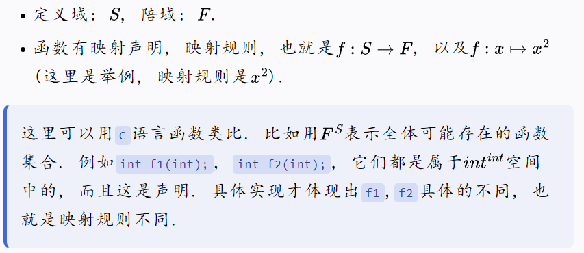
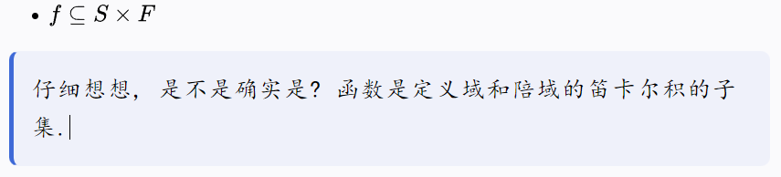
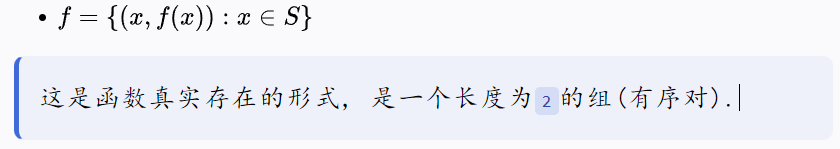
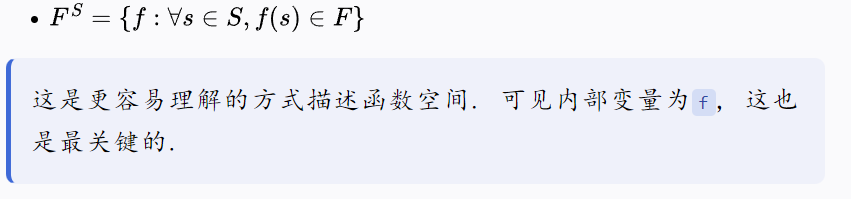
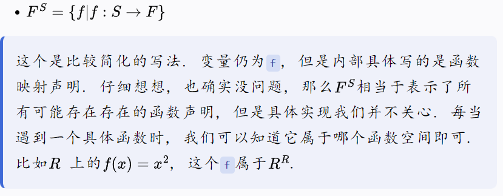
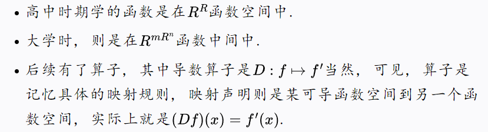
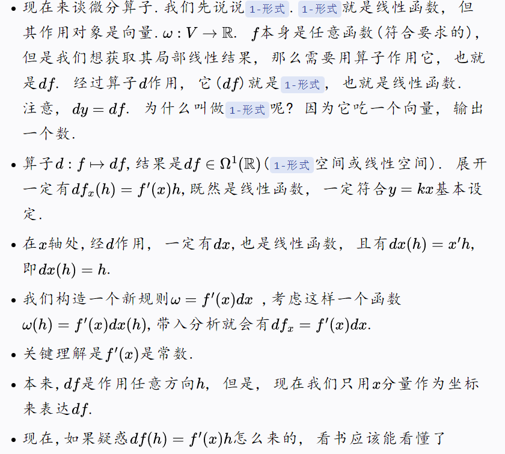

&emsp;&emsp;@author 巷北  
&emsp;&emsp;@time 2026-04-19 10:48:07  

# 动机

&emsp;&emsp;你真的懂函数吗? 不懂函数还敢直接分析函数空间? 步子迈得太大, 容易... 当发现自己陷进去的时候, 看看大问题是否能拆成小问题. 如果连小问题就搞不明白, 何谈直接解决大问题呢? 

# 基础分析

    

    

    

    

    

# 例子

    

    

# 归纳方法

当我们再次看到`F^S`时, 应该考虑什么呢?

- 是否符合基石呢?
- 它是一个集合 {变量:条件}
- 变量是`f`, 条件是映射声明. 而`f` 是某一具体的映射规则,所以`F^S`实际上就是函数的集合.
- 其中, `S`是定义域, `F`是陪域.
- 当我们思考其它函数时, 可以想想它是什么的函数集合.
