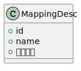
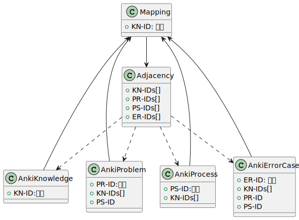
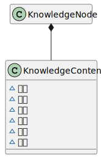
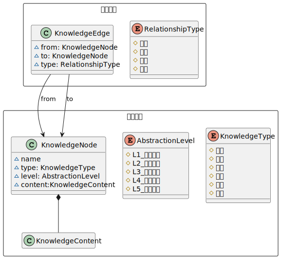
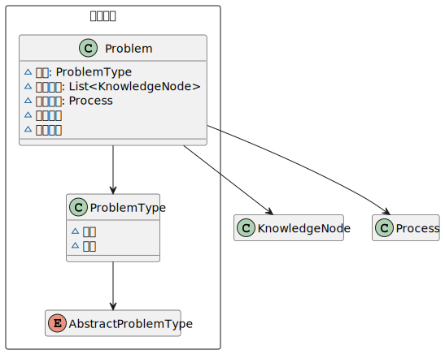
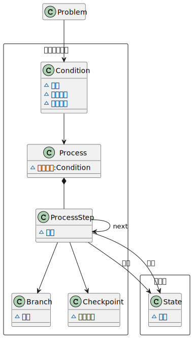
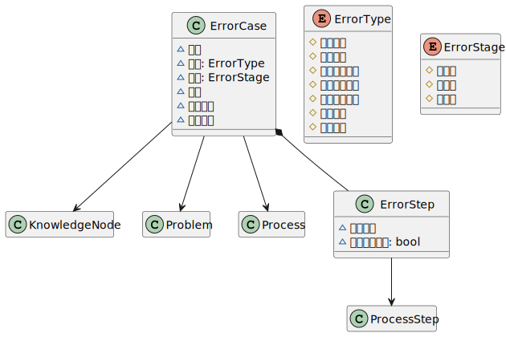
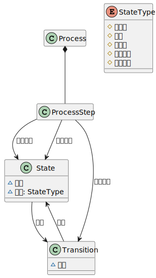

&emsp;&emsp;@author 巷北  
&emsp;&emsp;@time 2026-04-21 15:27:39  

  
<strong>🟩 描述符基本样式</strong>

    

  
<strong>🟩 mapping作用</strong>

    

- mapping只管`ID`映射作用, `Anki`只存储所有知识, 题目, 错误, 流程等, 以及额外的`ID`信息, 这样后续如果忘了, 不记得了, 又错了等情况发生时, 我们只需要找知识`ID`, 然后查映射表, 根据映射表找到跟这个知识相关的所有关系, 找到所有相关`ID`, 返回`Anki`, 继续复习即可.
- 假如有个题目做错了, 找知识`ID`, 查`mapping`, 找跟这个知识相关的所有`adjacency`, 复习, 学习.

  
<strong>🟩 5大学习层</strong>

  
<strong>🟦 知识层</strong>

    

    

- 注意, 写`Anki`的, 一定是知识展开图, 存`mapping`和`adjacency`的, 一定是知识关系图!

  
<strong>🟦 题目层</strong>

    

  
<strong>🟦 过程层</strong>

    

  
<strong>🟦 错误层</strong>

    

  
<strong>🟦 状态层</strong>

    

